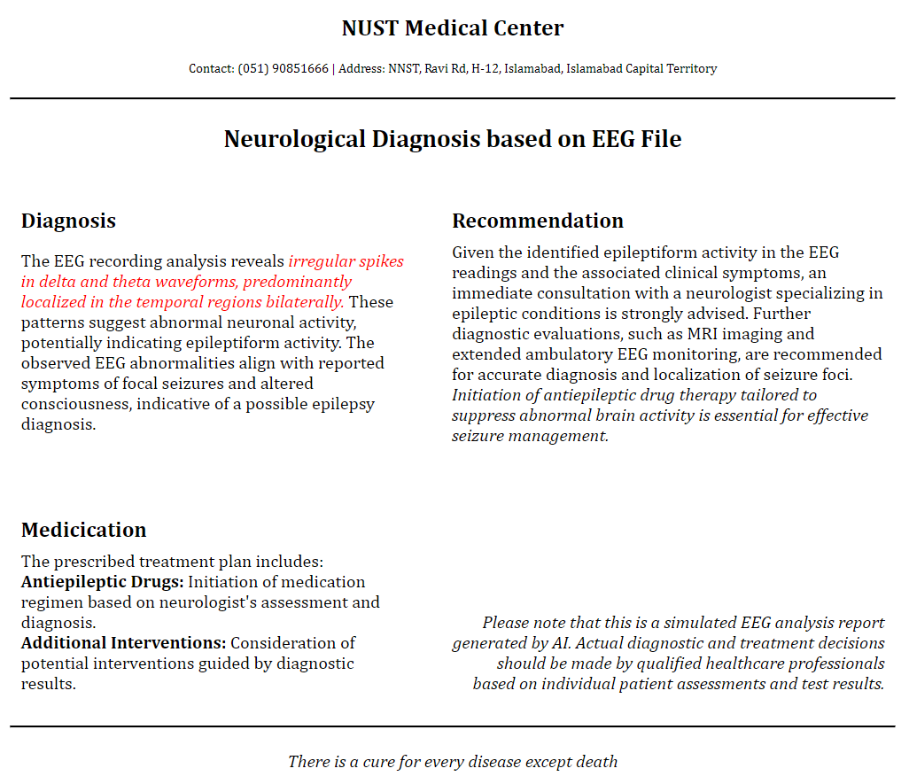

# Brainwave EEG Visualizer and Predictor

This project is a Brainwave EEG visualizer and predictor that includes predictions from a model trained at TUKL NUST. It visualizes EEG files using Rust.

## Features

1. Visualization of the EEG files
2. Predictions from the deep learnin model
3. Storing of EEG files in database for further fine tuning

## Technology Used

1. Vue.js for Frontend
2. Flask for the backend
3. RUST for visualizing EEG files
4. MySQL for storing files

## Instructions

### Frontend
1. Navigate to the `frontend/app` directory.
2. Run the following commands:
    ```bash
    npm install
    npm run serve
    ```

### Backend
1. Navigate to the `backend/server` directory.
2. Install the required dependencies:
    ```bash
    pip install -r requirements.txt
    ```
3. Run the backend server:
    ```bash
    python server.py
    ```
4. Additionally, run the model:
    ```bash
    python model.py
    ```

### Database
The database schema is given in the `backend/db` directory.

### Versions Used
- Node.js: 14.17.0
- Python: 3.10.11


## Screenshots
### Login


### Welcome


### Visualization


### Prediction


### File Store


### Sample Report


## Credits

For visualization of EEG files, [web-edf-viewer](https://github.com/mleprince/web-edf-viewer) repository was consulted.
